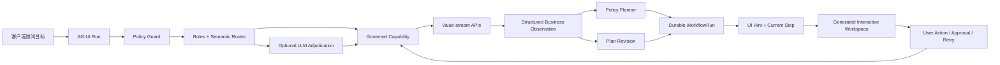

# Agentic Web 演示手册

## 1. 演示目标

这个 Demo 面向普通客户、养老金计划成员和 2B 业务顾问，展示他们如何通过自然语言进入一个可操作的金融业务工作区。

演示重点不是聊天机器人，也不是后台监控页面，而是以下体验：

1. 用户只描述业务目标，不需要理解后端 API 和系统边界。
2. Agent 识别意图，选择受治理的业务 capability，并组合多个现有 API。
3. Agent 根据业务结果制定步骤，生成适合当前任务的交互组件。
4. 用户操作会形成新观察，触发 capability 重新执行和计划修订。
5. 长任务、重试、持久化和人工审批成为工作流的一部分。
6. 不支持或不合规的请求会被明确识别，不会被强行路由到最接近的金融流程。

推荐演示地址：

```text
http://localhost:4102/agentic
```

## 2. 一句话讲清整体方案

> Agentic Web 不是让 LLM 自由调用所有底层 API，而是让 Agent 在受治理的 capability 目录内，持续执行“理解目标、调用工具、观察结果、调整计划、请求人工决策、完成任务”的闭环，并为当前步骤生成最合适的交互页面。

## 3. 建议演示时长

### 15 分钟完整版

| 环节 | 时间 | 重点 |
|---|---:|---|
| 产品定位与架构 | 2 分钟 | 面向客户和顾问，不是管理后台 |
| 域外意图边界 | 1 分钟 | 能识别，但不会越权执行 |
| ISA top-up | 4 分钟 | 图表、参数交互、重新校验、回退、人工确认 |
| Adviser review pack | 4 分钟 | 队列、长任务、checkpoint、retry、sign-off |
| Retirement goal gap | 3 分钟 | 动态插入或删除步骤、方案比较、长期预测 |
| Agentic 总结 | 1 分钟 | 用运行证据证明不是固定 UI 剧本 |

### 5 分钟精简版

1. 用“今天天气”展示 capability boundary。
2. 用 ISA 超额金额展示观察后回退和 plan v2。
3. 用 Retirement 展示根据概率动态插入或删除方案步骤。
4. 总结 Adviser 场景提供的 durable、retry、queue 和 human-in-the-loop 能力。

## 4. 演示前准备

### 启动服务

```bash
pnpm install
pnpm dev
```

主要服务：

| 服务 | 地址 | 作用 |
|---|---|---|
| Demo Web | `http://localhost:4102/agentic` | 客户或顾问使用的 Agentic Web |
| Capability Gateway | `http://localhost:4100` | 意图路由、策略控制、API 编排、工作流运行 |
| Mock APIs | `http://localhost:4101` | Fidelity UK 风格的合成业务 API |
| MCP Server | stdio | 向支持 MCP 的 Agent 客户端发布相同能力 |

### 演示前检查

```bash
curl http://localhost:4100/health
curl http://localhost:4101/health
pnpm --filter @agent-bridge/gateway eval:router
```

预期路由评测全部通过。

### 页面操作原则

- 点击左侧示例只会把问题填入输入框，不会自动执行。
- 必须由演示者点击 `Generate workspace`。
- 进入业务工作区后，始终聚焦当前 micro workflow 和当前步骤。
- 不需要讲右侧 runtime stream。AG-UI 事件由页面内部消费，用户看到的是业务结果。

## 5. 开场讲解

建议讲解：

> 传统数字金融页面先定义菜单、表单和固定流程，再要求用户学习系统。这里反过来，用户先表达目标，系统判断可以使用哪项受治理的业务能力，再根据实时业务结果生成当前任务所需的页面。用户不是在和一个只会回答问题的聊天框互动，而是在和一个能够持续完成工作的 Agent 协作。

页面上三个区域的含义：

1. **左侧业务场景**：用户问题和三个代表性旅程。
2. **顶部步骤条**：Gateway 当前返回的真实工作计划，不是单纯前端进度动画。
3. **Agent Work Brief**：展示 Agent 的目标、当前活动、计划依据、下一步和最新观察。

需要强调：界面只展示可解释的决策依据，不展示模型私有思维链。

## 6. 场景零：域外意图边界

### 操作

在输入框输入：

```text
今天天气
```

点击 `Generate workspace`。

### 页面预期

- 状态为 `unsupported`。
- 意图识别为 `general weather information`。
- 显示 capability boundary 页面，而不是 ISA 或养老金组件。
- 明确说明没有启动金融工作流，也没有调用客户数据 API。

### 建议讲解

> Agentic 不等于什么都尝试做。系统准确理解这是天气请求，但当前 capability 目录只发布 Fidelity UK 金融业务能力，因此它停在边界上。这里的重要行为是“理解但不越界”，而不是把域外问题错误匹配到最相似的金融能力。

### 实现方案

1. Policy guard 先检查敏感信息和客户范围。
2. 已知域外规则识别中英文天气、旅行等请求。
3. 返回结构化 `unsupported` resolution。
4. 前端根据 resolution 生成 boundary surface。
5. Gateway 不创建 `WorkflowRun`，也不调用下游金融 API。

### 展示的 Agentic 特性

- 能力边界感知
- 保守执行
- 结构化意图结果
- 不确定或不支持时停止，而不是幻觉式调用

## 7. 场景一：ISA Top-up Readiness

### 用户与业务目标

- 用户：Personal Investing 客户
- 目标：判断本税务年度能否追加 ISA，并完成受控确认
- Capability：`personal_investing_isa_allowance_review`
- Micro workflow：`isa_subscription_feasibility`

### 示例问题

```text
Can I add £8,000 to my Fidelity Stocks and Shares ISA this tax year?
```

### 主要 API 组合

```text
Profile API
Accounts API
ISA Subscription API
Holdings API
Policy audit
```

### 演示步骤 A：正常路径

1. 点击左侧 `ISA top-up`。
2. 点击 `Generate workspace`。
3. 观察 ISA allowance 饼图和 Agent Work Brief。
4. 点击 `Continue` 进入金额选择。
5. 保持金额在剩余额度内并点击 `Continue`。
6. 进入 customer confirmation，点击批准完成。

### 演示步骤 B：触发真实重规划

1. 在金额选择步骤把金额调整到 `£12,000`。
2. 点击 `Continue`。
3. Gateway 使用新金额重新调用 capability。
4. 业务结果返回 `requires_review`。
5. Agent 不继续确认，而是回到 `Choose amount`。
6. 页面显示 `plan v2`，说明金额超过可用额度，确认步骤被阻断。
7. 把金额改到 `£7,000`，再次继续。
8. 重新校验通过后进入 customer confirmation。

### 建议讲解

> 饼图和滑杆只是交互表现，真正的 Agentic 行为发生在用户修改金额之后。新金额被作为 workflow action payload 送回 Gateway，Gateway 重新调用 ISA capability，形成新的业务观察和 audit trace。由于结果变成 requires_review，Agent 修订计划并回退到金额选择，而不是让前端按预设动画继续前进。

### 页面组件

| 当前条件或步骤 | 动态组件 |
|---|---|
| 查看额度 | ISA allowance donut chart |
| 修改金额 | Amount slider 和校验提示 |
| 金额合法 | Customer confirmation gate |
| 金额超额 | Warning、回退后的金额选择、plan v2 |

### 展示的 Agentic 特性

- 多 API 组合
- 用户输入成为新观察
- Observe、replan、act 闭环
- 计划回退而非固定向前
- 金融规则优先于生成式自由度
- Human-in-the-loop 最终确认
- 新结果与新 audit trace 关联

## 8. 场景二：Adviser Portfolio Review Pack

### 用户与业务目标

- 用户：2B Adviser
- 目标：生成客户模型组合偏离和 evidence review pack
- Capability：`adviser_platform_model_portfolio_review`
- Micro workflow：`adviser_review_pack_generation`

### 示例问题

```text
Prepare a model portfolio drift review for this advised client on the adviser platform.
```

### 主要 API 组合

```text
Adviser entitlement
Client profile
Platform accounts
Model portfolio
Holdings
Evidence pack
```

### 演示步骤

1. 点击左侧 `Review pack`。
2. 点击 `Generate workspace`。
3. 在 `Start pack` 页面观察 durable run id 和 capability。
4. 点击 `Start queued task`。
5. 查看 portfolio allocation 饼图、drift score 和 evidence completeness。
6. 点击 `Continue` 进入 exception recovery。
7. 点击 `Retry projection`。
8. 观察 successful upstream results 被保留，attempt 次数更新。
9. 点击 `Continue` 进入 compliance sign-off。
10. 点击批准完成工作流。

### 建议讲解

> 这个场景模拟顾问常见的复杂长任务。资料收集、持仓分析和 evidence pack 不需要用户一直停留在页面。运行状态有独立 run id 并被持久化；某个投影节点失败时，Agent 从 checkpoint 重试，而不是重新执行所有已经成功的上游步骤。最终写入客户记录前仍需要顾问明确签署。

### 动态计划逻辑

- 如果 drift score 超过阈值或需要 rebalance，计划保留 `Resolve exception`。
- 如果 drift 在阈值内且不需要 rebalance，Agent 可以移除 exception recovery，直接进入 sign-off。
- 当前合成数据用于展示第一种路径。

### 页面组件

| 当前步骤 | 动态组件 |
|---|---|
| Start pack | Durable queue panel |
| Review drift | Portfolio donut、drift bars、evidence status |
| Resolve exception | Retry checkpoint panel |
| Sign off | Compliance approval gate |

### 展示的 Agentic 特性

- 长任务状态
- Durable workflow run
- Queue 语义
- Checkpoint 和 retry
- 保留已完成工具结果
- 基于 drift 结果调整计划
- Adviser human-in-the-loop
- 失败恢复后继续原任务，而不是重新开始对话

## 9. 场景三：Retirement Goal Gap

### 用户与业务目标

- 用户：Workplace Investing 成员
- 目标：判断 65 岁退休是否可行，并找到缩小目标差距的方案
- Capability：`workplace_pension_contribution_guidance`
- Micro workflow：`retirement_goal_gap_projection`

### 示例问题

```text
Am I on track to retire at 65, and what contribution change would close the gap?
```

### 主要 API 组合

```text
Member profile
Pension balance
Contribution schedule
Projection
Target income
Policy audit
```

### 演示步骤 A：低于目标概率，动态插入方案

1. 点击左侧 `Goal gap`。
2. 点击 `Generate workspace`。
3. 初始业务结果约为 `70%` goal probability。
4. Agent 的初始计划在 `Set goal` 与 `Run projection` 之间插入 `Explore options`。
5. 保持 `12% / age 65` 并点击 `Continue`。
6. 查看 Agent 生成的三个方案：提高缴费、延后退休、组合调整。
7. 选择一个方案，系统用新参数重新运行 capability。
8. 继续 durable projection，最后查看 scenario comparison。

### 演示步骤 B：新证据使步骤不再需要

1. 重新生成场景。
2. 在第一个 `Set goal` 页面把参数调整为 `14% / age 67`。
3. 点击 `Continue`。
4. 新投影约为 `84%`。
5. Agent 将计划升级为 `plan v2`，删除不再需要的 `Explore options`。
6. 页面直接进入 `Run projection`。

### 建议讲解

> 同一个用户问题不会永远得到同一组页面。初次投影低于 75% 时，Agent 增加方案探索组件；参数改善后重新投影达到 84%，Agent 观察到目标已进入可接受区间，于是删除不再有价值的步骤。这说明页面结构来自当前计划和业务结果，而不是写死的三屏 wizard。

### 页面组件

| 当前条件或步骤 | 动态组件 |
|---|---|
| 设置目标 | Contribution slider、retirement age control |
| 概率低于 75% | Agent-generated gap option selector |
| 长期预测 | Durable long-task checkpoint |
| 完成计算 | Scenario comparison bars |

### 展示的 Agentic 特性

- 基于业务阈值动态插入步骤
- 新观察触发步骤删除
- 参数化工具重调用
- 多方案生成与选择
- 长期任务恢复
- UI 结构随计划变化
- 可解释 plan revision

## 10. 整体实现链路



### 10.1 意图识别

路由采用分层方案：

```text
Policy guard
  -> prompt preprocessing
  -> deterministic rules
  -> local semantic router
  -> optional LLM adjudicator for ambiguous top-K
  -> conservative fallback
```

- 清晰意图通常由本地语义路由处理，不强制消耗 LLM。
- 模糊候选可以交给 LLM adjudicator。
- 敏感、域外或低置信度请求优先停止或澄清。
- 每次结果包含 routing trace，但最终用户界面只展示必要的业务解释。

### 10.2 Capability 而不是裸 API

Agent 不直接获得所有 API 权限。每个 capability 发布：

- 业务目标
- 输入和输出 schema
- 所需 API
- 数据分类
- 执行计划
- 路由样例
- 策略与确认要求

这样可以把“Agent 能做什么”和“底层系统怎么实现”分离。

### 10.3 API 编排

Gateway 根据 capability 调用多个 value-stream API，并组合为 Agent-readable result，例如：

- `source_apis`
- `policy_checks`
- `audit_trace_id`
- 业务指标和判断
- 建议的 next actions

前端不需要理解每个原始 API 的响应格式。

### 10.4 Observe 和 Replan

`WorkflowRun` 保存：

- `agent.objective`
- `agent.currentActivity`
- `agent.decisionRationale`
- `agent.nextAction`
- `observations`
- `steps`
- `planRevisions`
- `events`
- `auditTraceId`

用户修改参数、retry 或 approve 时，操作会提交到 Workflow API。需要重新计算的动作会再次执行 capability，将结果记录为 observation，然后决定：

- 保持当前计划
- 插入步骤
- 删除步骤
- 回退到前一步
- 阻断后续步骤
- 请求人工审批

### 10.5 动态 UI 生成

后端步骤包含受控的 `uiHint`：

```text
allowance_donut
amount_slider
approval_gate
durable_queue
portfolio_drift
retry_checkpoint
goal_controls
gap_options
long_task
scenario_comparison
```

前端根据当前步骤选择组件，并使用 capability result 填充数据。

这是一种受治理的 A2UI 风格实现：Agent 可以动态组合经过设计和审查的组件原语，而不是生成任意 HTML 或任意金融交互。

### 10.6 AG-UI 的作用

`POST /agui/runs` 使用 SSE 返回运行事件，例如：

- `RUN_STARTED`
- `STATE_DELTA`
- `TOOL_CALL_START`
- `TOOL_CALL_END`
- `CUSTOM`
- `RUN_FINISHED`

AG-UI 负责把 Agent 运行状态传递给客户端。当前页面隐藏原始 stream 面板，只把事件转化为加载状态、业务结果和工作区变化，避免把客户体验做成工程监控台。

### 10.7 Durability、Retry 和 Human-in-the-loop

- Workflow run 有独立 id。
- 当前 POC 将运行状态持久化到本地 JSON，Gateway 重启后可以恢复。
- Retry 增加 attempt，并保留已成功步骤的状态。
- Approval 是受控 action，只有当前步骤允许时才能执行。
- Action 必须匹配当前 step id，不能跳步或对历史步骤执行。

## 11. 为什么它不只是固定流程和 UI 变化

### 固定的是受治理的边界

以下内容应该固定或经过审查：

- Capability catalog
- 可调用 API 范围
- 输入输出 schema
- 金融策略阈值
- 允许的 action
- 审批要求
- 可用 UI 组件原语

这些固定内容保证可预测性、合规性和品牌一致性。

### 动态的是任务执行

以下内容由当前输入和实时结果决定：

- 识别出的 capability
- API 组合结果
- 业务 observation
- 当前计划步骤
- 步骤是否插入、删除或回退
- 当前生成的组件类型
- 组件中的数据和可操作项
- 是否需要 retry
- 是否需要 human approval
- 新的 audit trace 和 plan revision

### 演示中的可验证证据

| 证据 | 如何观察 |
|---|---|
| 不是固定路由 | 输入“今天天气”不会进入当前选中的金融示例 |
| 不是固定向前流程 | ISA 超额后退回金额选择并阻断确认 |
| 不是固定页面数量 | Retirement 根据概率插入或删除 `Explore options` |
| 不是本地 UI 假状态 | 用户 action 调用 `/workflow-runs/:runId/actions` |
| 不是一次性静态结果 | 参数变化后 capability 被重新执行并产生新结果 |
| 有可持续状态 | Workflow run、attempt、events 和 plan revision 被持久化 |
| 有工具使用 | Capability 后面组合多个 value-stream API |
| 有人工控制 | ISA confirmation 和 adviser sign-off 必须明确 approve |
| 有治理边界 | 域外、敏感或跨客户请求不会调用下游业务 API |

## 12. “这是不是写死的”推荐回答

> 不是让 Agent 任意发明金融流程，也不是把所有内容都交给 LLM。我们固定了经过治理的 capability、金融控制和 UI 原语，这是企业系统必须保留的确定性。动态部分是 Agent 根据用户目标和 API 结果选择能力、形成观察、调整计划、决定下一步以及组合当前页面。ISA 的回退和 Retirement 的步骤增删都发生在 Gateway 的 WorkflowRun 中，前端只是渲染后端返回的当前计划。

## 13. LLM 在哪里，为什么不让 LLM 控制一切

当前实现：

- Policy guard：确定性规则或专用 provider
- 清晰意图：本地 semantic router
- 模糊意图：可选 LLM adjudicator
- 金融步骤规划：可审计的 policy planner
- UI：受控组件原语加动态数据

推荐讲解：

> Agentic 的核心不是每一步都经过 LLM，而是系统能围绕目标持续观察、行动和调整。对于金融业务，关键策略和审批边界需要确定性与可审计性；LLM 更适合处理自然语言理解和模糊候选裁决。这样既保留 Agent 的适应性，也避免把受监管决策变成不可预测的自由生成。

## 14. 当前 POC 边界

为了避免过度承诺，演示时需要明确：

1. 业务 API 是 Fidelity UK 风格的 synthetic mock APIs，不连接真实客户数据。
2. 当前持久化使用本地 JSON，不是生产数据库或 event store。
3. Queue、long task 和 checkpoint 已实现工作流状态语义，但不是外部分布式队列或真实异步 worker 集群。
4. Retry 会保留运行状态并重新组合 capability，生产实现还需要幂等键、退避策略、死信队列和补偿事务。
5. A2UI 当前使用 typed `uiHint` 和受控组件 registry，不是任意模型生成前端代码。
6. LLM adjudicator 是否启用取决于本地配置；没有配置时使用保守 fallback。

## 15. 生产化演进方向

| POC | 生产演进 |
|---|---|
| 本地 JSON WorkflowRun | Durable execution engine、数据库或 event store |
| 合成 API | 真实 Fidelity API gateway 和 entitlement |
| 简化 retry | 幂等、指数退避、dead-letter、compensation |
| 本地 UI registry | 版本化 enterprise component catalog |
| 策略阈值写在 planner | 外部 policy engine 和可版本化规则 |
| 单机 SSE | 可恢复事件流、session resume、跨设备通知 |
| 简化 audit | Append-only audit store、trace correlation、监管留档 |
| 可选 LLM | Model gateway、prompt/version governance、evaluation gates |

## 16. 演示结束语

建议结束语：

> 这个 Demo 展示的不是一个更漂亮的聊天框，而是一种新的业务应用形态。用户从目标开始，Agent 在受治理的能力范围内调用工具、观察结果、调整计划，并把复杂 API 编排转化为当前最需要的交互页面。固定的是企业边界，动态的是完成工作的路径。

## 17. 快速验证命令

### 意图边界

```bash
curl -X POST http://localhost:4100/intent/resolve \
  -H 'content-type: application/json' \
  -d '{"prompt":"今天天气"}'
```

### 路由评测

```bash
pnpm --filter @agent-bridge/gateway eval:router
```

### 构建检查

```bash
pnpm --filter @agent-bridge/shared build
pnpm --filter @agent-bridge/gateway typecheck
pnpm --filter @agent-bridge/demo-web build
```

### 主要接口

```text
POST /intent/resolve
POST /agui/runs
POST /agent/request
POST /capabilities/:capabilityId/invoke
GET  /workflow-runs/:runId
POST /workflow-runs/:runId/actions
GET  /audit/:traceId/events
```

