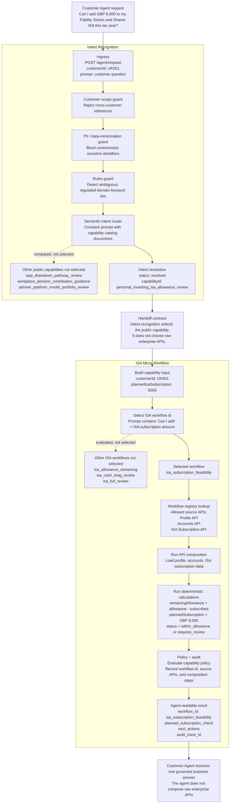

# ISA Capability Micro-Workflow Design

## Key Concept
Agents express the customer objective, but regulated systems execute governed
business workflows rather than exposing unrestricted backend API composition.

## Context

The gateway exposes business capabilities rather than raw value-stream APIs. The
ISA capability remains a single published capability:

`personal_investing_isa_allowance_review`

Internally, different ISA customer requests need different backend API
compositions. A remaining-allowance question should not call holdings data, while
a cash-drag review does need allocation context. The implementation therefore
uses a lightweight capability-internal micro-workflow registry.

## Decision

Use a controlled micro-workflow registry inside the ISA capability.

Do not split the ISA surface into multiple public capabilities yet, and do not
introduce a full workflow engine for the POC. The public capability contract stays
stable for agents and MCP clients, while the gateway selects a narrower internal
workflow for execution.

The request may pass `isaWorkflowId` explicitly, or the gateway may infer it from
the prompt when using `/agent/request`.

Supported workflow ids:

| Workflow id | Primary intent | Source APIs |
| --- | --- | --- |
| `isa_allowance_remaining` | Answer how much ISA allowance remains | Profile API, ISA Subscription API |
| `isa_subscription_feasibility` | Check whether a planned subscription fits | Profile API, Accounts API, ISA Subscription API |
| `isa_cash_drag_review` | Review uninvested cash and allocation | Profile API, Accounts API, ISA Subscription API, Holdings API |
| `isa_full_review` | Preserve the original full ISA review behavior | Profile API, Accounts API, ISA Subscription API, Holdings API |

Every response includes:

- `workflow_id`
- `sub_intent`
- `composition_mode: "capability_internal_micro_workflow"`
- `workflow_reasoning`
- workflow-specific `source_apis`
- normal policy checks and audit trace

## Why Not Only `subIntent`

`subIntent` is useful as a label, but it is not enough as an execution model.
The gateway also needs to know which APIs may be called, what audit steps are
expected, which calculations apply, and how to map the result for the agent.

The registry turns the intent label into an auditable execution plan.

## Why Not A Full Workflow Engine

A full workflow engine is useful for long-running, stateful, recoverable, or
human-in-the-loop processes. The current ISA flows are short, synchronous, and
highly regulated. Keeping them in TypeScript makes policy checks, calculations,
and result mapping easy to review.

This follows the same broad industry pattern as agentic financial services:
agents express the customer objective, but regulated systems execute governed
business workflows rather than exposing unrestricted backend API composition.
MCP is used as a standardized agent-facing interface; it does not replace the
business control plane.

## CALM-Inspired Principles

The public Morgan Stanley CALM material was not available in this repository, so
this design does not depend on a CALM runtime. It borrows the architectural idea
described in the discussion:

- keep business capability contracts stable and discoverable
- choose a controlled execution path inside the capability
- separate agent intent resolution from deterministic business execution
- expose source APIs, policy checks, and audit traces back to the customer agent

## Example

Prompt:

```text
Can I add £8,000 to my Fidelity Stocks and Shares ISA this tax year?
```

Resolved capability:

```text
personal_investing_isa_allowance_review
```

Internal workflow:

```text
isa_subscription_feasibility
```

Gateway execution:

```text
Profile API + Accounts API + ISA Subscription API
-> allowance calculation
-> planned subscription check
-> policy + audit
-> agent-readable result
```

The customer agent receives one governed business result. It does not decide
which enterprise APIs to call.

## Vertical Flow

The same example flows through two explicit stages. Intent recognition resolves
the public business capability. The ISA micro-workflow stage then chooses the
controlled execution path and source APIs inside that capability.


