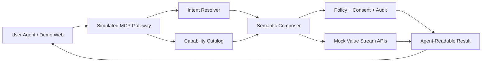

# POC Architecture

## Objective

This POC proves that a financial firm can expose enterprise capabilities to customer-facing agents through a governed capability gateway.

The key architectural point is:

```text
Expose business capabilities, not raw APIs.
```

## Logical Architecture



## Service Boundaries

### 1. Mock Value Stream APIs

Location:

```text
apps/mock-apis
```

Purpose:

```text
Represent existing enterprise systems inside the financial firm.
```

Mock APIs:

```text
GET  /profile/:customerId
GET  /accounts/:customerId
GET  /holdings/:customerId
GET  /contributions/:customerId
GET  /tax-limits/:customerId
POST /projection
```

These APIs intentionally return raw domain data. They are not agent-friendly by themselves.

### 2. Capability Gateway

Location:

```text
apps/gateway
```

Purpose:

```text
Simulate an MCP-style gateway that exposes business capabilities.
```

Gateway responsibilities:

- Capability discovery
- Intent resolution
- API composition
- Policy and consent checks
- Audit trace generation
- Agent-readable result formatting

Current capabilities:

```text
retirement_readiness_assessment
contribution_optimization
```

### 3. Demo Web Agent

Location:

```text
apps/demo-web
```

Purpose:

```text
Simulate a customer-owned or customer-facing agent calling the platform.
```

The UI shows:

- Agent request
- Discovered capabilities
- Resolved capability
- Structured result
- Source APIs
- Policy checks
- Composition trace

## Capability Composition

### Retirement Readiness Assessment

```text
retirement_readiness_assessment
    = Profile API
    + Accounts API
    + Holdings API
    + Projection API
    + policy checks
    + audit trace
    + agent-readable response
```

### Contribution Optimization

```text
contribution_optimization
    = Profile API
    + Accounts API
    + Contribution API
    + Tax Limits API
    + Projection API
    + consent requirement
    + audit trace
    + agent-readable response
```

## Extension Path

This POC is intentionally implemented as a simulated MCP gateway. The capability catalog is local and the value stream APIs are mock services. Intent resolution can use a real OpenAI-compatible LLM when `.env` provides `LLM_API_KEY`, `LLM_MODEL`, and optionally `LLM_BASE_URL`; otherwise it falls back to rules.

The architecture leaves room for later POCs:

1. Expose each capability as a real MCP tool.
2. Add additional value streams such as CAM or Brokerage.
3. Replace mock APIs with enterprise sandbox APIs.
4. Add OAuth, customer consent artifacts, and entitlement checks.
5. Add A2A only when agent-to-agent collaboration is required.
