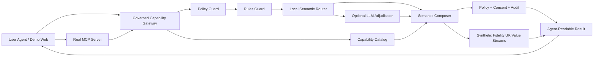

# POC Architecture

## Objective

This POC proves that a financial firm can expose enterprise capabilities to customer-facing agents through a governed capability gateway.

The key architectural point is:

```text
Expose business capabilities, not raw APIs.
```

## Logical Architecture


```mermaid
flowchart LR
    Agent["User Agent / Demo Web"]
    McpServer["Real MCP Server"]
    Gateway["Governed Capability Gateway"]
    Catalog["Capability Catalog"]
    PolicyGuard["Policy Guard"]
    RulesGuard["Rules Guard"]
    SemanticRouter["Local Semantic Router"]
    LlmAdjudicator["Optional LLM Adjudicator"]
    Composer["Semantic Composer"]
    Policy["Policy + Consent + Audit"]
    ValueStreams["Synthetic Fidelity UK Value Streams"]
    Result["Agent-Readable Result"]

    Agent --> Gateway
    Agent --> McpServer
    McpServer --> Gateway
    Gateway --> Catalog
    Gateway --> PolicyGuard
    PolicyGuard --> RulesGuard
    RulesGuard --> SemanticRouter
    SemanticRouter --> LlmAdjudicator
    SemanticRouter --> Composer
    LlmAdjudicator --> Composer
    Catalog --> Composer
    Composer --> Policy
    Composer --> ValueStreams
    Policy --> Result
    ValueStreams --> Result
    Result --> Agent
```

## Service Boundaries

### 1. Synthetic Fidelity UK Value Stream APIs

Location:

```text
apps/mock-apis
```

Purpose:

```text
Represent existing enterprise systems inside the financial firm with synthetic Fidelity UK-style demo data.
```

Value stream APIs:

```text
GET  /profile/:customerId
GET  /accounts/:customerId
GET  /holdings/:customerId
GET  /contributions/:customerId
GET  /tax-limits/:customerId
GET  /isa-subscriptions/:customerId
GET  /drawdown/:customerId
GET  /workplace-plan/:customerId
GET  /adviser-portfolio/:customerId
POST /projection
```

These APIs intentionally return raw domain data. They are not agent-friendly by themselves.

### 2. Capability Gateway

Location:

```text
apps/gateway
```

Purpose:

```text
Expose governed business capabilities to HTTP clients and to the real MCP stdio server.
```

Gateway responsibilities:

- Capability discovery
- Layered intent routing
- API composition
- Policy and consent checks
- Audit trace generation
- Agent-readable result formatting

Current capabilities:

```text
personal_investing_isa_allowance_review
sipp_drawdown_pathway_review
workplace_pension_contribution_guidance
adviser_platform_model_portfolio_review
```

Intent routing stages:

```text
1. Policy guard
   Blocks sensitive identifiers and other hard policy violations before semantic routing.

2. Rules guard
   Detects deterministic regulated-domain conflicts, such as equal-strength ISA and SIPP signals,
   and asks for clarification instead of silently downgrading to a lower-risk capability.

3. Local semantic router
   Compares the request against vectors built from capability metadata and example prompts.
   Clear matches resolve without an LLM call.

4. Optional LLM adjudicator
   Runs only for ambiguous semantic matches and receives only the top-K candidate capabilities.

5. Conservative fallback
   Returns unsupported when no layer can safely select a published capability.
```

Each resolution includes `routingTrace`, which is surfaced in the demo UI and MCP/HTTP responses so reviewers can see which layer passed, resolved, escalated, denied, or fell back.

### 3. Demo Web Agent

Location:

```text
apps/demo-web
```

Purpose:

```text
Simulate a customer-owned or customer-facing agent calling the platform.
```

The UI shows:

- Agent request
- Discovered capabilities
- Resolved capability
- Structured result
- Source APIs
- Policy checks
- Composition trace

### 4. MCP Server

Location:

```text
apps/mcp-server
```

Purpose:

```text
Expose the governed capability gateway through the real Model Context Protocol.
```

Implementation:

```text
MCP TypeScript SDK v2 beta split packages:
- @modelcontextprotocol/server
- @modelcontextprotocol/client for smoke verification
```

Transport:

```text
stdio
```

MCP resources:

```text
agent-bridge://gateway/health
agent-bridge://capabilities
```

MCP tools:

```text
list_capabilities
resolve_intent
invoke_capability
agent_request
```

The MCP server is intentionally a protocol adapter over `apps/gateway`; it does not reimplement financial capability logic. This keeps HTTP clients and MCP clients on the same policy, composition, and audit path.

## Capability Composition

### Personal Investing ISA Allowance Review

```text
personal_investing_isa_allowance_review
    = Profile API
    + Accounts API
    + ISA Subscription API
    + Holdings API
    + policy checks
    + audit trace
    + agent-readable response
```

### SIPP Drawdown Pathway Review

```text
sipp_drawdown_pathway_review
    = Profile API
    + Accounts API
    + Drawdown API
    + Pension Allowance API
    + Retirement Projection API
    + consent requirement
    + audit trace
    + agent-readable response
```

### Workplace Pension Contribution Guidance

```text
workplace_pension_contribution_guidance
    = Profile API
    + Workplace Plan API
    + Contribution API
    + Pension Allowance API
    + Retirement Projection API
    + consent requirement
    + audit trace
    + agent-readable response
```

### Adviser Platform Model Portfolio Review

```text
adviser_platform_model_portfolio_review
    = Adviser Entitlement API
    + Client Profile API
    + Platform Accounts API
    + Model Portfolio API
    + Holdings API
    + policy checks
    + audit trace
    + agent-readable response
```

## Extension Path

This POC uses a real MCP TypeScript SDK v2 beta stdio server as the MCP surface. The capability catalog is local and the value stream APIs are synthetic Fidelity UK-style demo services. Intent routing first uses policy, deterministic, and local semantic layers. It can use a real OpenAI-compatible LLM when `.env` provides `LLM_API_KEY`, `LLM_MODEL`, and optionally `LLM_BASE_URL`, but only as an adjudicator for ambiguous top-K semantic candidates. If the LLM is unavailable, the gateway keeps using semantic routing, clarification, and conservative unsupported handling.

The architecture leaves room for later POCs:

1. Add additional MCP tools and resources as the capability catalog grows.
2. Add additional value streams such as transfers, dealing, secure messaging, and adviser servicing.
3. Replace synthetic APIs with enterprise sandbox APIs.
4. Add OAuth, customer consent artifacts, and entitlement checks.
5. Replace the local semantic router with managed embeddings and a vector index when the catalog grows.
6. Add A2A only when agent-to-agent collaboration is required.
