# Agent-Friendly Service Interface Model for Financial Firms

> Focus: Customer Agent, MCP Gateway, Semantic Capability Layer, and Retirement Value Stream examples.

---

## 1. Mermaid Flowchart Script

```mermaid
flowchart LR
    %% =========================================================
    %% Agent-Friendly Service Interface Model
    %% Focus: Customer Agent, MCP, Retirement Examples
    %% =========================================================

    %% 1. Channels
    subgraph CH["1. Channels"]
        direction TB
        CustomerAgent["Customer Agent<br/>(Primary)"]
        Website["Website<br/>(Browser Agent)"]
        Mobile["Mobile App<br/>(Native App / In-App Agent)"]
    end

    %% 2. Solution
    subgraph SOL["2. Agent-Friendly Interface Solution"]
        direction TB
        MCP["MCP Gateway<br/>(Primary Interface)"]
        WebMCP["WebMCP<br/>(Website Interaction)"]
        MobileAdapter["Native App Adapter<br/>App Intents / Deep Links / Mobile BFF"]
        A2A["A2A<br/>(Optional Agent-to-Agent Collaboration)"]
    end

    %% 3. Semantic Capability Abstraction
    subgraph CAP["3. Semantic Capability Abstraction"]
        direction TB
        Catalog["Capability Catalog<br/>What business capabilities are available?"]
        Composition["Intent-Based Composition<br/>Which APIs, rules, and data are needed?"]
        Governance["Consent, Policy & Audit<br/>What is allowed, confirmed, and traceable?"]
        Result["Agent-Readable Result<br/>Structured answer, next actions, and context"]
    end

    %% 4. Enterprise Value Streams
    subgraph VS["4. Enterprise Value Streams"]
        direction TB

        subgraph RET["Retirement Value Stream"]
            direction TB
            Readiness["Retirement Readiness<br/>Profile + Accounts + Holdings + Projection"]
            Contribution["Contribution Optimization<br/>Profile + Accounts + Contribution + Tax Limits + Projection"]
        end

        CAM["CAM"]
        Brokerage["Brokerage"]
    end

    %% Channel to solution
    CustomerAgent --> MCP
    Website --> WebMCP
    Mobile --> MobileAdapter

    WebMCP --> MCP
    MobileAdapter --> MCP
    A2A -. optional collaboration .-> MCP

    %% Solution to capability abstraction
    MCP --> Catalog
    Catalog --> Composition
    Composition --> Governance
    Governance --> Result

    %% Capability abstraction to value streams
    Result --> Readiness
    Result --> Contribution

    Result --> CAM
    Result --> Brokerage

    %% Key message callouts
    Msg1["MCP exposes business capabilities,<br/>not just raw APIs"]
    Msg2["One Agent request may combine<br/>multiple existing APIs and rules"]
    Msg3["Returned result is structured for<br/>Agent reasoning and next actions"]

    MCP -.-> Msg1
    Composition -.-> Msg2
    Result -.-> Msg3

    %% Styling
    classDef primary fill:#DCEEFF,stroke:#1E63B6,stroke-width:3px,color:#0B2545;
    classDef secondary fill:#EEF6FF,stroke:#7AA7D9,stroke-width:1.5px,color:#0B2545;
    classDef capability fill:#FFF4D6,stroke:#D6A22A,stroke-width:1.5px,color:#3A2A00;
    classDef value fill:#EAFBF7,stroke:#168A87,stroke-width:1.5px,color:#063B3B;
    classDef example fill:#FFFFFF,stroke:#31A39B,stroke-width:1.2px,color:#063B3B;
    classDef note fill:#FFFFFF,stroke:#999999,stroke-dasharray: 5 5,color:#333333;

    class CustomerAgent,MCP primary;
    class Website,Mobile,WebMCP,MobileAdapter,A2A secondary;
    class Catalog,Composition,Governance,Result capability;
    class CAM,Brokerage value;
    class Readiness,Contribution example;
    class Msg1,Msg2,Msg3 note;
```



---

## 2. Flowchart Design Explanation

This flowchart describes how a financial institution can expose existing enterprise capabilities to customer-facing agents in an agent-friendly way.

The diagram is organized from left to right into four parts:

```text
Channels → Agent-Friendly Interface Solution → Semantic Capability Abstraction → Enterprise Value Streams
```

### 2.1 Channels

The left side shows where requests may originate.

| Channel | Role |
|---|---|
| Customer Agent | The primary target channel. This could be a customer-owned AI assistant, external agent, or delegated digital representative. |
| Website | A browser-based channel where agents may interact with web pages and web-exposed capabilities. |
| Mobile App | A native or in-app experience where mobile-specific integration patterns are needed. |

The diagram highlights **Customer Agent** as the primary entry point because the core goal is to make financial services accessible to external or customer-facing agents, not just human-operated UI channels.

### 2.2 Agent-Friendly Interface Solution

The second section shows the interface patterns used to make enterprise capabilities accessible to agents.

| Interface | Recommended Role |
|---|---|
| MCP Gateway | The primary interface pattern for customer-facing agents. It exposes business capabilities rather than raw APIs. |
| WebMCP | Suitable for website and browser-agent interaction. It is best used when the website itself needs to expose structured, agent-readable interaction surfaces. |
| Native App Adapter | Suitable for mobile apps. Mobile apps typically need native app integration, app intents, deep links, mobile SDKs, or a Mobile BFF that routes into the MCP Gateway. |
| A2A | Optional. More suitable for agent-to-agent collaboration than for direct customer-agent-to-enterprise-API access. |

The key design point is that **MCP is not simply a one-to-one wrapper around existing APIs**. Instead, the MCP Gateway should expose higher-level business capabilities that agents can discover, understand, and invoke.

### 2.3 Semantic Capability Abstraction

The third section converts raw enterprise APIs into agent-facing business capabilities.

```text
Capability Catalog
        ↓
Intent-Based Composition
        ↓
Consent, Policy & Audit
        ↓
Agent-Readable Result
```

#### Capability Catalog

Answers: **What business capabilities are available to agents?**

It is not just an API inventory. It defines business-level capabilities such as retirement readiness assessment, contribution optimization, account summary, rollover guidance, or advisor planning brief.

Each capability may map to multiple APIs, rules, data sources, and required permissions.

#### Intent-Based Composition

Answers: **Which APIs, rules, and data sources are needed for the current agent request?**

A single agent request may require multiple backend calls. The system dynamically composes the required APIs based on user intent, available context, permissions, and business rules.

#### Consent, Policy & Audit

Answers: **What is allowed, what requires customer confirmation, and what must be traceable?**

In financial services, this layer governs customer consent, agent authorization, data access entitlements, regulatory restrictions, human review requirements, audit trail generation, and traceability of API calls and decision logic.

#### Agent-Readable Result

Answers: **How should the result be returned so that an agent can understand it and take the next step?**

The output should not be a raw API response. It should be structured, contextual, explainable, and actionable.

Typical result content includes summary, key findings, evidence, source APIs or capabilities, next best actions, required confirmations, risk or compliance notes, and audit trace ID.

### 2.4 Enterprise Value Streams

The right side shows existing business domains inside the financial company.

The diagram keeps the value streams intentionally simple:

- Retirement
- CAM
- Brokerage

The Retirement value stream is expanded slightly to show two example agent-facing scenarios:

1. Retirement Readiness
2. Contribution Optimization

These examples demonstrate how the same enterprise APIs can be reused and recomposed differently depending on the agent's intent.

---

## 3. Scenario Use Cases

## 3.1 Scenario 1: Retirement Readiness

### Example Agent Request

```text
Can this client retire at age 60 based on current assets and projected income?
```

Or:

```text
Assess my retirement readiness and explain the key risks.
```

### Business Meaning

This scenario is not just a balance inquiry. It evaluates whether the customer is financially on track for retirement.

It needs to answer questions such as:

- Who is the customer?
- What is the target retirement age?
- What retirement accounts does the customer have?
- What is the current retirement balance?
- What assets are held in those accounts?
- What is the projected future balance?
- Is there an income gap?
- What are the major risks?

### APIs Used

| API | Purpose |
|---|---|
| Profile API | Gets customer age, income, household status, retirement goal, risk profile, and planning assumptions. |
| Accounts API | Gets retirement accounts, account types, balances, and account status. |
| Holdings API | Gets asset allocation, funds, ETFs, equities, bonds, cash, and risk exposure. |
| Projection API | Projects future balance, estimated retirement income, income replacement ratio, and goal probability. |

### Example API Composition

```text
Retirement Readiness
    = Profile API
    + Accounts API
    + Holdings API
    + Projection API
    + business rules
    + policy checks
    + agent-readable response formatting
```

### Example Agent-Readable Result

```json
{
  "capability": "retirement_readiness_assessment",
  "summary": "The client is moderately prepared for retirement at age 60, but projected income may cover only 82% of the target retirement spending.",
  "readiness_score": 82,
  "key_factors": [
    "Current retirement account balance",
    "Target retirement age",
    "Asset allocation",
    "Projected contribution growth",
    "Expected retirement spending"
  ],
  "risks": [
    "Retiring at 60 reduces accumulation period",
    "Portfolio is moderately exposed to market volatility",
    "Projected income gap remains under current assumptions"
  ],
  "next_actions": [
    "Review target retirement spending",
    "Consider increasing contributions",
    "Run an alternative retirement age scenario",
    "Schedule advisor review"
  ],
  "source_apis": [
    "Profile API",
    "Accounts API",
    "Holdings API",
    "Projection API"
  ]
}
```

### Key Point

Retirement Readiness is a **business capability**, not a single API. The MCP Gateway composes multiple existing APIs and returns a structured result that an agent can reason about.

---

## 3.2 Scenario 2: Contribution Optimization

### Example Agent Request

```text
Should I increase my retirement contribution this year?
```

Or:

```text
What contribution change would improve my retirement outcome without exceeding limits?
```

### Business Meaning

This scenario focuses on what the customer should change next. It is more action-oriented than Retirement Readiness.

It needs to answer questions such as:

- What is the customer's current contribution rate?
- What retirement accounts are eligible for contribution?
- How much has the customer contributed this year?
- What is the remaining annual contribution room?
- Is the customer eligible for catch-up contribution?
- Would increasing contribution improve retirement readiness?
- Does the proposed change require customer confirmation?

### APIs Used

| API | Purpose |
|---|---|
| Profile API | Gets customer age, income, employment status, tax profile, retirement target, and risk profile. |
| Accounts API | Gets eligible retirement accounts, plan type, current balance, and contribution options. |
| Contribution API | Gets current contribution rate, year-to-date contribution, employer contribution, and history. |
| Tax Limits API | Gets annual contribution limits, remaining contribution room, catch-up eligibility, and tax constraints. |
| Projection API | Compares retirement outcomes under current and increased contribution scenarios. |

### Example API Composition

```text
Contribution Optimization
    = Profile API
    + Accounts API
    + Contribution API
    + Tax Limits API
    + Projection API
    + business rules
    + consent checks
    + agent-readable response formatting
```

### Example Agent-Readable Result

```json
{
  "capability": "contribution_optimization",
  "summary": "Increasing the client's contribution rate from 8% to 11% may improve projected retirement readiness from 82% to 89%, while remaining below the annual contribution limit.",
  "current_contribution_rate": "8%",
  "recommended_contribution_rate": "11%",
  "estimated_impact": {
    "readiness_score_before": 82,
    "readiness_score_after": 89,
    "projected_additional_retirement_assets": 86000
  },
  "constraints_checked": [
    "Annual contribution limit",
    "Catch-up eligibility",
    "Employer match rules",
    "Plan eligibility"
  ],
  "next_actions": [
    {
      "action": "confirm_contribution_change",
      "requires_customer_confirmation": true
    },
    {
      "action": "show_cashflow_impact",
      "requires_additional_calculation": true
    },
    {
      "action": "schedule_advisor_review",
      "recommended": true
    }
  ],
  "source_apis": [
    "Profile API",
    "Accounts API",
    "Contribution API",
    "Tax Limits API",
    "Projection API"
  ]
}
```

### Key Point

Contribution Optimization is also a business capability. It shares some APIs with Retirement Readiness, but composes them differently and adds contribution-specific and tax-limit-specific logic.

---

## 4. Relationship Between the Two Retirement Scenarios

The two scenarios are intentionally similar but not identical.

| API | Retirement Readiness | Contribution Optimization | Role |
|---|---:|---:|---|
| Profile API | Yes | Yes | Customer demographics, income, goals, risk profile |
| Accounts API | Yes | Yes | Retirement account types, balances, eligibility |
| Projection API | Yes | Yes | Long-term retirement outcome projection |
| Holdings API | Yes | Optional / usually no | Asset allocation and investment risk |
| Contribution API | Optional | Yes | Current and historical contribution behavior |
| Tax Limits API | Usually no | Yes | Annual contribution limit, catch-up eligibility, tax constraints |

### Interpretation

```text
Retirement Readiness is more assessment-oriented.
Contribution Optimization is more action-oriented.
```

Both scenarios reuse common APIs such as Profile API, Accounts API, and Projection API.

But each scenario adds different supporting APIs depending on the business intent.

This is exactly the value of an MCP-based service model:

```text
The Agent asks for a business outcome.
The MCP Gateway identifies the required capability.
The Semantic Capability Layer composes the right APIs, rules, and data.
The result is returned in a structured, agent-readable way.
```

---

## 5. Recommended Presentation Narrative

### Step 1: Start from the Customer Agent

The primary user is no longer only a human clicking through a website or mobile app. Increasingly, a customer may delegate tasks to an external or personal agent.

The enterprise therefore needs a service interface that is understandable and usable by agents.

### Step 2: MCP Becomes the Primary Agent Interface

The MCP Gateway should be positioned as the primary interface for customer-facing agents.

It should not be described as a thin API wrapper. Its role is to expose business capabilities in a discoverable, structured, governed, and agent-readable format.

### Step 3: Web and Mobile Need Different Patterns

Website interaction can use WebMCP where browser agents need to understand and interact with web capabilities.

Mobile apps should not be forced into WebMCP. A more practical pattern is:

```text
Mobile App → Native App Adapter / App Intents / Deep Links / Mobile BFF → MCP Gateway
```

### Step 4: A2A Is Optional

A2A should be positioned as optional agent-to-agent collaboration.

It is useful when:

- An external agent needs to collaborate with an enterprise-owned agent.
- Internal domain agents need to coordinate.
- A long-running cross-agent workflow is needed.

It should not be the default interface for customer agents directly accessing enterprise capabilities.

### Step 5: The Real Value Is Semantic Composition

The most important message is:

```text
MCP is not a 1:1 mapping to existing APIs.
```

A single agent-facing capability may combine multiple APIs, rules, policies, consent checks, and data sources.

The Retirement examples make this concrete:

- Retirement Readiness combines Profile, Accounts, Holdings, and Projection.
- Contribution Optimization combines Profile, Accounts, Contribution, Tax Limits, and Projection.
- Both reuse common APIs, but return different agent-facing outcomes.

---

## 6. Final Summary

This model helps a financial company move from traditional API exposure to agent-friendly capability exposure.

Traditional model:

```text
Application → API endpoint → raw response
```

Agent-friendly model:

```text
Agent intent
    → MCP Gateway
    → Semantic Capability Layer
    → composed enterprise APIs, rules, and data
    → governed, structured, agent-readable result
```

The design principle is:

> Expose business capabilities, not raw APIs.

The MCP Gateway acts as the primary agent-facing interface. WebMCP supports website interactions. Mobile apps use native adapters that route into the MCP Gateway. A2A is optional for agent-to-agent collaboration.

The Retirement examples demonstrate that multiple existing APIs can be reused across different business scenarios. This allows the enterprise to preserve existing systems while making them easier for agents to discover, compose, invoke, and explain.
