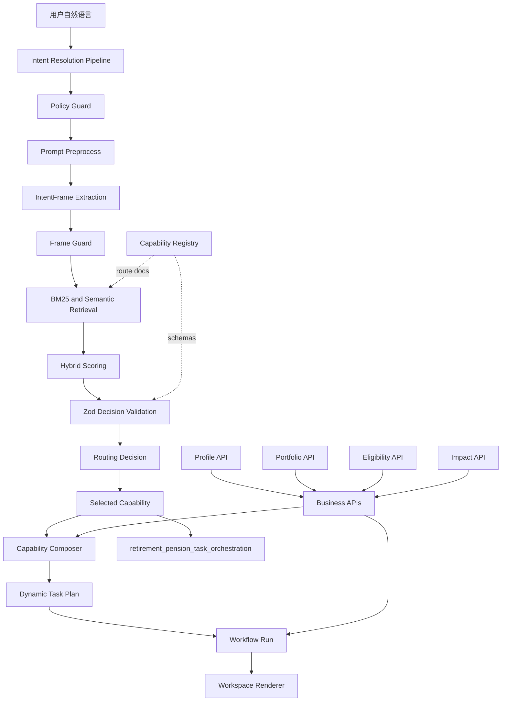

# Agentic Web 公积金/养老金 Demo 讲解稿

这份文档用于边演示边解释本次 `Agentic Web` demo 的技术架构。核心场景是：

> 我最近手头紧，要提取一些公积金

演示目标不是证明“用户少点几次按钮”，而是证明：

> 原来用户必须自己弄清楚该做什么，现在系统能够围绕用户目标组织整个服务。

因此，这个 demo 应该体现三件事：

1. 用户可以用模糊自然语言开始，而不是先找业务入口。
2. 系统能把模糊需求逐步收敛到具体业务能力。
3. 工作区不是固定页面，而是由意图、能力、规则和 task plan 动态组装出来。

## 1. 演示入口

打开：

```bash
http://localhost:4102/agentic
```

首页默认问题已经改成：

```text
我最近手头紧，要提取一些公积金
```

演示时点击发送，观察左侧工作区从空状态变成“公积金提取方案”。

这里要强调：

> 用户没有选择“公积金服务 > 提取 > 住房提取 > 资格检查”这些菜单。用户只是表达目标，系统负责寻找服务路径。

## 2. 整体架构

本次实现可以拆成五层，但要注意：`Intent` 的识别不是几条平行路线同时决定结果，而是一条纵向收敛流水线。`Capability Registry` 更像旁路知识源，为检索、评分和校验提供能力描述、示例、schema 与安全边界。



关键点：

- `Intent Resolution Pipeline` 是主流程，用户输入会从上到下经过策略、预处理、意图框架、检索、评分和校验。
- `Capability Registry` 不直接“执行一步”，而是为 pipeline 提供可匹配、可校验、可治理的能力目录。
- `BM25 Retriever` 和 `Semantic Router` 只负责召回候选 capability，不单独决定最终业务。
- `Zod Decision Validation` 校验最终 routing decision，保证 `resolved` 一定绑定合法 capability。
- `Retirement Pension Capability` 是统一能力，不是一个固定页面。
- `Capability Composer` 结合用户子意图、规则和业务 API 结果，生成当前任务需要的业务结果和 `Task Plan`。
- `Business APIs` 是 capability / workflow 使用的上游数据源，不是和 `Task Plan` 并列的页面步骤。
- `Task Plan` 根据子意图和业务结果动态选择阶段。
- `Workflow Run` 把 task plan 变成可推进、可审计的运行实例，后续阶段也可以继续调用业务 API。
- `Workspace Renderer` 根据结果渲染面向用户的工作区。

## 3. 意图如何被筛选和收敛

相关实现：

- `apps/gateway/src/intent.ts`
- `apps/gateway/src/routeBm25Store.ts`
- `apps/gateway/src/routeCatalog.ts`
- `evals/cn-pension-router-cases.jsonl`

### 3.1 第一层：IntentFrame

系统先把用户输入抽取成一个轻量意图框架：

```ts
{
  domain: "housing_fund",
  goal: "withdraw_funds",
  polarity: "positive",
  actionability: "transaction_intent"
}
```

这一步解决的是“不要一看到关键词就进业务”的问题。

例如：

```text
帮我
```

会被识别为：

```ts
{
  domain: "unknown",
  goal: "unknown",
  actionability: "none"
}
```

结果是 `unsupported`，不会进入公积金提取。

再比如：

```text
不要提取一些公积金
```

会被识别为负向请求：

```ts
{
  domain: "housing_fund",
  goal: "cancel_or_decline",
  polarity: "negative"
}
```

结果同样不会启动业务。

### 3.2 第二层：BM25 + Semantic Hybrid

只靠关键词不够，尤其中文短句会很碎，比如：

```text
帮我取公积金
```

所以新增了本地 BM25 召回：

```ts
const bm25RouteStore = new LocalBm25RouteStore(buildRouteDocuments());
```

`routeCatalog.ts` 会把 capability 的名称、描述、业务结果、API、示例问题、routing metadata 合成 route document。BM25 会对这些文档做快速检索。

然后 `intent.ts` 把三类信号合并：

```text
BM25 分数
+ Semantic router 分数
+ IntentFrame 对 capability 的领域加权
```

这样做的价值是：

- BM25 适合短文本、中文词面命中。
- Semantic router 适合语义相近但不完全同词的表达。
- IntentFrame 防止语义召回把无效请求误推到高风险业务。

### 3.3 第三层：Zod 决策校验

最终 routing decision 会经过 Zod 校验：

```ts
const RoutingDecisionSchema = z.object({
  status: z.enum(["resolved", "needs_clarification", "unsupported", "denied"]),
  capabilityId: z.enum(capabilityIds).optional()
}).superRefine(...)
```

这保证：

> 只要状态是 `resolved`，就必须有合法 capabilityId。

也就是说，模型或检索器不能返回半截脏结果。

## 4. Capability 如何配置

相关实现：

- `apps/gateway/src/catalog.ts`

本场景对应统一能力：

```ts
retirement_pension_task_orchestration
```

它不是“公积金提取页面”，而是一个面向养老金/公积金任务的能力边界：

```text
养老金/公积金任务编排能力
```

它声明了：

- 支持哪些输入：`pensionTaskIntent`、`requestedWithdrawalAmount`、`targetRetirementAge`
- 会调用哪些 API：画像、账户、资格、影响测算、退休领取方案
- 会输出什么：`task_plan`、账户信息、资格结果、影响结果、下一步动作
- 风险级别：`high`
- 是否需要客户确认：`true`

这体现了 Agentic Web 的核心：

> 企业暴露的不是页面，而是可发现、可组合、可治理的业务能力。

## 5. Task Plan 如何动态生成

相关实现：

- `apps/gateway/src/composers.ts`

统一 capability 内部有三个子意图：

```ts
type PensionTaskIntent =
  | "cash_access_exploration"
  | "retirement_claim_planning"
  | "pot_composition";
```

用户输入：

```text
我最近手头紧，要提取一些公积金
```

会收敛到：

```text
cash_access_exploration
```

于是 task plan 组装为：

```text
解析用户目标
→ 读取会员画像
→ 读取账户信息
→ 检查可提取资格
→ 估算到账影响
→ 等待你的决定
```

如果用户输入：

```text
我准备退休，想知道什么时候退休最合适，以及应该怎样领取养老金
```

同一个 capability 会生成另一组 task plan：

```text
解析用户目标
→ 读取会员画像
→ 读取账户信息
→ 生成退休时间线
→ 比较领取策略
→ 下一步决策门
```

如果用户输入：

```text
我的养老金中各项比例是多少
```

则只需要：

```text
解析用户目标
→ 读取会员画像
→ 读取账户信息
→ 查看账户构成
```

这里要强调：

> 不是后台提前写死三张页面，而是同一个 capability 根据子意图返回不同 task_plan。

## 6. Workflow Run 如何承接 Task Plan

相关实现：

- `apps/gateway/src/workflowRuns.ts`

`composeRetirementPensionTaskOrchestration()` 返回 `task_plan` 后，workflow runtime 会把它转换成可运行步骤：

```ts
if (microWorkflowId === "retirement_pension_task_orchestration") {
  const taskPlan = Array.isArray(result.task_plan) ? result.task_plan : [];
  steps.splice(0, steps.length, ...taskPlan.map(...));
}
```

这说明：

- capability 负责生成当前任务需要哪些阶段；
- workflow runtime 负责把阶段变成可推进的运行实例；
- UI 通过 `workflowRun.currentStepIndex` 显示当前进度；
- 所有步骤都有运行状态和审计信息。

这不是“LLM 随机生成流程”，而是：

> 受控阶段库 + capability 输出 + workflow runtime 生成实例。

## 7. 工作区如何体现“减少无意义操作，保留有意义决定”

相关实现：

- `apps/demo-web/src/main.tsx`

公积金提取工作区会直接展示：

- 目标金额
- 预计到账
- 账户余额
- 身份状态
- 可行路径
- 提取用途
- 是否超过路径上限
- 下一步是否进入受控申请

用户不需要先做这些事情：

```text
找入口
查规则
重复填年龄、账户、身份
自己计算到账影响
自己判断哪条路径能走
```

但系统仍然保留关键决定：

- 选择真实用途
- 比较低影响方案
- 是否进入受控申请
- 正式申请前完成条款确认、身份验证、最终授权

这正是 demo 要表达的价值：

> Agent 承担理解系统和准备业务的负担，用户只承担目标表达、关键判断和最终授权。

## 8. 金额变化如何动态影响结果

演示：

```text
先试试提取30000
```

工作区会更新为：

```text
从公积金账户提取 ¥30,000
预计到账 ¥27,600 - ¥28,500
```

再演示：

```text
我要提取100万
```

能力层会计算当前所有可行路径的上限，并返回：

```text
limit_check.status = "blocked"
```

工作区应该展示：

```text
目标金额超过所有可行路径上限
无法继续提交申请
```

这说明流程不是固定文案，而是由业务结果驱动。

## 9. 为什么需要 Eval

相关实现：

- `evals/cn-pension-router-cases.jsonl`
- `evals/fidelity-uk-router-cases.jsonl`

本次改动后验证结果：

```text
中文路由 eval: 16/16
英文路由 eval: 16/16
```

中文 eval 覆盖了几类关键边界：

```text
我最近手头紧，要提取一些公积金       → resolved
帮我取公积金                         → resolved
我准备退休...怎样领取养老金           → resolved
我的养老金中各项比例是多少             → resolved
不要提取一些公积金                    → unsupported
帮我                                 → unsupported
公积金                               → needs_clarification
历史里有天气，但最新请求是帮我取公积金 → resolved
```

Eval 的意义不是追求“命中关键词”，而是防止三类退化：

1. 模糊请求被误导入高风险业务。
2. 否定请求仍然启动业务。
3. 持续对话中的历史上下文污染最新意图。

## 10. 演示时推荐讲法

可以按下面顺序讲：

### 第一步：自然语言进入

用户输入：

```text
我最近手头紧，要提取一些公积金
```

讲解：

> 传统 Web 要求用户先找入口。这里用户只表达目标，gateway 先判断这是否是一个可治理的业务意图。

### 第二步：意图收敛

讲解：

> 系统先抽取 IntentFrame，判断是公积金领域、资金提取目标、正向请求、可执行意图。然后用 BM25 和语义路由匹配到统一的养老金/公积金任务编排能力。

### 第三步：Capability 接管

讲解：

> 进入 capability 后，不是马上提交申请，而是先加载已知画像和账户，生成当前任务需要的 task plan。

### 第四步：动态工作区出现

讲解：

> 工作区展示的是业务准备结果，不是固定页面。系统已经完成读取账户、资格路径、影响测算，但还没有提交申请。

### 第五步：用户做关键判断

讲解：

> 这里保留的是有意义的选择：用途、是否比较低影响方案、是否进入受控申请。只有进入受控申请后，才会出现条款、身份验证和最终授权。

### 第六步：改金额验证动态性

用户继续输入：

```text
先试试提取30000
```

讲解：

> 同一个 task session 没有重走入口，只是更新金额事实并重新测算影响。

再输入：

```text
我要提取100万
```

讲解：

> 业务能力返回超限状态，工作区阻止继续申请。这不是前端写死的按钮禁用，而是 capability 的规则结果驱动。

## 11. 当前实现边界

这个 demo 已经体现了 Agentic Web 的架构形态，但仍是演示级实现：

- `IntentFrame` 目前是代码规则抽取，不是独立模型服务。
- BM25 是本地内存检索，不是外部向量/搜索服务。
- 公积金 workflow 使用 mock API，不是真实政务或金融系统。
- 动态 UI 是受控组件组合，不允许模型自由生成交易页面。

更生产化的下一步是：

1. 把 `IntentFrame` 抽取升级为小模型或结构化 LLM，并保留 Zod 校验。
2. 把 route documents 接到真实 capability registry。
3. 把 BM25 + 向量检索做成统一 retriever。
4. 把 task plan 的 stage registry 从代码迁移到后端配置。
5. 为每个高风险业务维护 eval 集，作为发布门禁。

## 12. 一句话总结

这个 demo 的本质不是“聊天框生成页面”，而是：

> 用户表达目标后，系统通过意图框架、能力检索、受控 task plan 和 workflow runtime，把企业服务动态组织成当前用户真正需要的工作区。
