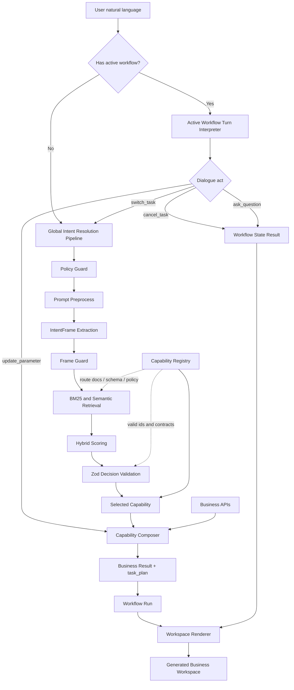

# Agentic Web 公积金/养老金 Demo 讲解稿

这份文档用于边演示边解释当前 `Agentic Web` demo 的整体方案。它不只是一个“聊天框生成页面”的演示，而是展示：

> 用户表达目标后，系统如何通过意图识别、能力注册、能力组合、工作流运行和动态 UI 组装，把企业服务组织成当前任务需要的工作区。

核心演示从这个问题开始：

```text
我最近手头紧，要提取一些公积金
```

第二条推荐演示线是：

```text
我准备退休，想知道什么时候退休最合适，以及应该怎样领取养老金。
```

这两条线共用同一个后端能力 `retirement_pension_task_orchestration`，但会生成不同的 task plan 和不同的工作区组件。

## 1. 演示入口

打开：

```bash
http://localhost:4102/agentic
```

如果 `4102` 被占用，Vite 会自动切到下一个端口，例如：

```bash
http://localhost:4104/agentic
```

演示重点不是“少点几个按钮”，而是：

> 传统 Web 要求用户先理解服务目录；Agentic Web 允许用户先表达目标，再由系统在受治理能力目录内组织服务路径。

演示时可以先点默认问题：

```text
我最近手头紧，要提取一些公积金
```

然后继续输入：

```text
我要提取2万
```

再输入：

```text
不取了
```

这三个 turn 分别展示：

- 初始意图如何路由到能力。
- 当前 workflow 内如何更新参数并重新测算。
- 当前 workflow 内如何解释取消动作，而不是误调用能力或沿用旧结果。

## 2. 总体架构

当前实现可以拆成七层：

1. `Intent Resolution Pipeline`
2. `Capability Registry`
3. `Capability Composer`
4. `Dynamic Task Plan`
5. `Workflow Run`
6. `Active Workflow Turn Interpreter`
7. `Workspace Renderer`



关键解释：

- 没有 active workflow 时，用户输入先进入全局意图路由。
- 已经有 active workflow 时，新消息先进入 `Active Workflow Turn Interpreter`。
- 只有当用户明显切换任务时，才回到全局 capability router。
- `update_parameter` 会在当前 workflow 内更新输入并重新调用能力。
- `cancel_task` 会结束/暂停当前 workflow，并渲染 workflow state，而不是启动新能力。
- 页面不是模型自由生成的 HTML，而是由 `task_plan.component` 映射到受控组件 registry。

## 3. 全局意图识别：从自然语言到能力

相关实现：

- `apps/gateway/src/intent.ts`
- `apps/gateway/src/routeCatalog.ts`
- `apps/gateway/src/routeBm25Store.ts`
- `apps/gateway/src/semanticIntentRouter.ts`
- `evals/cn-pension-router-cases.jsonl`

### 3.1 IntentFrame

系统先抽取轻量结构化意图框架。

用户输入：

```text
我最近手头紧，要提取一些公积金
```

会被抽取为：

```ts
{
  domain: "housing_fund",
  goal: "withdraw_funds",
  polarity: "positive",
  actionability: "transaction_intent"
}
```

如果用户输入：

```text
公积金
```

系统会认为领域明确，但目标不明确，返回 clarification：

```text
你是想提取公积金、查看账户构成，还是咨询退休/领取方案？
```

如果用户输入：

```text
不要提取公积金
```

会被抽取为：

```ts
{
  domain: "housing_fund",
  goal: "cancel_or_decline",
  polarity: "negative",
  actionability: "none"
}
```

这类请求不会启动业务 workflow。

### 3.2 BM25 + Semantic Hybrid

`Capability Registry` 会被转换为 route documents。每个 document 包含：

- capability id
- capability name
- description
- business outcome
- input schema
- required APIs
- routing domains
- keywords
- positive / negative examples

BM25 负责中文短句和词面召回，比如：

```text
帮我取公积金
```

Semantic router 负责语义相似度。最终分数不是单一路由器决定，而是：

```text
BM25 score
+ semantic score
+ IntentFrame domain boost
```

这样可以同时避免两类问题：

- 只靠关键词导致否定请求误触发。
- 只靠语义相似导致模糊请求误进入高风险能力。

### 3.3 Zod Decision Validation

最终 routing decision 会经过 schema 校验：

```ts
status: "resolved" | "needs_clarification" | "unsupported" | "denied"
capabilityId?: CapabilityId
```

规则是：

> 只要 `status === "resolved"`，就必须绑定合法 capability id。

这保证检索器、LLM 或混合路由不能产生半截、不合法的业务决策。

## 4. 能力注册：企业暴露的是能力，不是页面

相关实现：

- `apps/gateway/src/catalog.ts`
- `apps/gateway/src/capabilityPackages.ts`

本场景使用统一能力：

```ts
retirement_pension_task_orchestration
```

它不是“公积金提取页面”，而是一个可治理的业务能力边界：

```text
养老金/公积金任务编排能力
```

它声明：

- 支持输入：`pensionTaskIntent`、`requestedWithdrawalAmount`、`targetRetirementAge`
- 需要 API：会员画像、养老金账户、公积金资格、到账影响、退休领取方案
- 输出结果：`summary`、`task_plan`、`pension_portfolio`、`withdrawal_impact`、`retirement_options`、`next_actions`
- 数据分级：`restricted`
- 风险级别：`high`
- 正式执行是否需要客户确认：`true`

演示时要强调：

> Agentic Web 的治理边界在 capability contract 里，而不是散落在页面按钮里。

## 5. 能力组合：同一个能力根据子意图生成不同 task plan

相关实现：

- `apps/gateway/src/composers.ts`

统一能力内部有三个子意图：

```ts
type PensionTaskIntent =
  | "cash_access_exploration"
  | "retirement_claim_planning"
  | "pot_composition";
```

### 5.1 公积金提取探索

输入：

```text
我最近手头紧，要提取一些公积金
```

收敛为：

```ts
pensionTaskIntent = "cash_access_exploration"
```

生成 task plan：

```text
解析用户目标
→ 读取会员画像
→ 读取账户信息
→ 检查可提取资格
→ 估算到账影响
→ 等待你的决定
```

输出包含：

- `customer`
- `pension_portfolio`
- `withdrawal_eligibility`
- `withdrawal_impact`
- `limit_check`
- `next_actions`

### 5.2 退休规划与领取策略

输入：

```text
我准备退休，想知道什么时候退休最合适，以及应该怎样领取养老金。
```

收敛为：

```ts
pensionTaskIntent = "retirement_claim_planning"
```

生成 task plan：

```text
解析用户目标
→ 读取会员画像
→ 读取账户信息
→ 生成退休时间线
→ 比较领取策略
→ 下一步决策门
```

输出包含：

- `retirement_options.target_retirement_age`
- 不同退休年龄下的 projected balance
- estimated monthly income
- fit score
- claim strategies
- next actions

这条线用于说明：

> 同一个 capability 不是只有“提取”一种服务路径，它能根据用户目标选择规划、比较和领取策略组件。

### 5.3 账户构成分析

输入：

```text
我的养老金中各项比例是多少
```

只需要：

```text
解析用户目标
→ 读取会员画像
→ 读取账户信息
→ 查看账户构成
```

这说明 task plan 是能力组合结果，不是固定流程。

## 6. Workflow Run：把 task plan 变成可运行实例

相关实现：

- `apps/gateway/src/workflowRuns.ts`

能力返回 `task_plan` 后，workflow runtime 会生成 `WorkflowRun`：

```ts
steps = taskPlan.map(stage => ({
  id: stage.id,
  label: stage.title,
  detail: pensionStageDetail(stage.id),
  allowedActions: ["advance"],
  uiHint: "scenario_comparison"
}));
```

`WorkflowRun` 提供：

- `currentStepIndex`
- step status
- allowed actions
- observations
- plan revisions
- events
- audit trace id

这不是“页面上画一个步骤条”，而是一个可以继续推进、重试、观察和修订的运行实例。

## 7. Active Workflow Turn：多轮对话不是每句都重新路由

相关实现：

- `packages/shared/src/index.ts`
- `apps/gateway/src/server.ts`
- `apps/demo-web/src/main.tsx`

这是当前 demo 最重要的架构更新。

旧问题是：

1. 第一轮进入公积金提取 workflow。
2. 第二轮用户说“我要提取2万”。
3. 如果全局路由只看这句话，会缺少“公积金”领域上下文。
4. 如果机械补上下文，第三轮“不取了”又可能被误包装成正向提取。

因此现在不再把每一句 follow-up 都交给全局 router，而是先解释它相对于当前 workflow 的动作。

结构化输出：

```ts
type WorkflowDialogueAct =
  | "update_parameter"
  | "cancel_task"
  | "choose_option"
  | "continue_application"
  | "ask_question"
  | "switch_task"
  | "new_task";
```

前端会把 active workflow context 传给 gateway：

```ts
{
  workflowId: "pension-cash-access",
  microWorkflowId: "retirement_pension_task_orchestration",
  capabilityId: "retirement_pension_task_orchestration",
  currentInput: {
    customerId: "CN001",
    pensionTaskIntent: "cash_access_exploration",
    requestedWithdrawalAmount: 20000
  }
}
```

### 7.1 参数更新

用户继续输入：

```text
我要提取2万
```

解释结果：

```ts
{
  dialogueAct: "update_parameter",
  extractedParameters: {
    requestedWithdrawalAmount: 20000
  },
  shouldInvokeCapability: true,
  shouldUseGlobalRouter: false
}
```

结果：

- 不重新找 capability。
- 不重新问用户想做哪个业务。
- 直接用当前 workflow 输入 + 新金额重新调用 capability。
- 工作区更新为 `¥20,000` 的到账影响。

### 7.2 取消当前任务

用户继续输入：

```text
不取了
```

解释结果：

```ts
{
  dialogueAct: "cancel_task",
  shouldInvokeCapability: false,
  shouldUseGlobalRouter: false
}
```

结果：

- 不调用公积金资格 API。
- 不调用到账测算 API。
- 不沿用上一轮 `¥20,000` 结果。
- 返回 `WorkflowState` 组件：

```text
已停止本次公积金提取探索；没有提交申请，也没有调用资金办理接口。
```

这才是 Agentic 多轮任务的关键：

> 用户新消息先被解释为当前 workflow 的状态转移，而不是每轮都重新做全局意图路由。

## 8. 页面动态生成：task_plan.component 驱动组件 registry

相关实现：

- `apps/demo-web/src/main.tsx`

当前公积金工作区不是 `workflow.id === pension-cash-access` 后渲染一整张写死页面，而是：

```text
result.task_plan
→ task_plan.component
→ pensionComponentRegistry
→ rendered workspace
```

组件 registry 包括：

```ts
{
  IntentSummary,
  KnownFacts,
  AccountStrip,
  EligibilityRoutes,
  ImpactPreview,
  DecisionGate,
  WorkflowState
}
```

公积金提取 task plan 会渲染：

```text
IntentSummary
→ KnownFacts
→ AccountStrip
→ EligibilityRoutes
→ ImpactPreview
→ DecisionGate
```

取消当前任务时，workflow-local result 会渲染：

```text
WorkflowState
```

演示时可以说：

> 页面不是模型自由生成，也不是固定路由页面，而是 capability 输出的 typed task plan 驱动受控组件组合。

## 9. 用户体验原则：Agent 负责准备，用户负责关键判断

公积金工作区自动完成：

- 识别目标
- 读取会员画像
- 读取账户与余额
- 检查可行路径
- 估算到账区间
- 估算长期权益影响
- 检查路径上限

用户仍然要做：

- 选择真实用途
- 比较低影响方案
- 决定是否进入受控申请
- 正式申请前完成条款确认、身份验证和最终授权

这不是“全自动替用户办业务”，而是：

> Agent 承担理解系统和准备业务的负担；用户保留关键判断和最终授权。

## 10. 推荐演示脚本

### 10.1 公积金提取探索

输入：

```text
我最近手头紧，要提取一些公积金
```

讲解：

> 用户没有选择菜单。系统先做全局意图识别，命中养老金/公积金任务编排能力，然后 capability 生成公积金提取探索 task plan。

观察页面：

- 意图已收敛
- 自动补全资料
- 账户构成
- 可行路径
- 到账影响
- DecisionGate

继续输入：

```text
我要提取2万
```

讲解：

> 这不是新任务。Active Workflow Turn Interpreter 把它解释成 update_parameter，只更新 requestedWithdrawalAmount，然后重新测算。

继续输入：

```text
不取了
```

讲解：

> 这也不是新任务。系统把它解释成 cancel_task，直接渲染 WorkflowState，明确说明没有提交申请，也没有调用资金办理接口。

### 10.2 超限场景

输入：

```text
我要提取100万
```

讲解：

> 当前所有可行路径的上限来自业务 API。能力返回 `limit_check.status = "blocked"`，页面因此阻止进入申请。

这说明：

> 阻断不是前端写死按钮，而是业务能力结果驱动。

### 10.3 退休规划

切换或输入：

```text
我准备退休，想知道什么时候退休最合适，以及应该怎样领取养老金。
```

讲解：

> 同一个 `retirement_pension_task_orchestration` capability 现在选择的是 `retirement_claim_planning` 子意图，而不是公积金提取。

观察页面：

- 退休时间线
- 不同退休年龄的预计月收入
- fit score
- 领取策略比较
- 受控领取申请入口

可以继续输入：

```text
63岁退休呢？
```

讲解：

> 这个方向可以进一步扩展为 workflow-local `update_parameter`，更新 `targetRetirementAge` 并重新调用退休领取方案 API。当前演示已经具备目标字段和 API，后续可以把这一轮也接入 active workflow turn interpreter。

### 10.4 长任务场景

另一个可展示长任务的现有示例是：

```text
Show the retirement impact of increasing contributions through salary sacrifice.
```

对应 workflow：

```text
retirement_goal_gap_projection
```

它展示：

- long task
- durable workflow
- retry checkpoint
- 根据 projection 结果插入或移除 comparison step

讲解：

> Agentic Web 不只是一次性生成页面。对于长任务，workflow runtime 可以保存 checkpoint、观察结果、修订 plan，并恢复执行。

## 11. 当前演示覆盖的 Agentic Web 特征

| 特征 | 当前覆盖方式 |
| --- | --- |
| 自然语言入口 | 用户用中文目标启动 |
| 能力注册 | `catalog.ts` 中声明 capability contract |
| 能力检索 | route docs + BM25 + semantic router |
| 结构化意图 | IntentFrame + Zod validation |
| 能力组合 | composer 根据子意图调用不同 API |
| 动态 task plan | capability 输出 `task_plan` |
| 工作流运行 | `WorkflowRun` 保存 steps / events / revisions |
| 多轮任务解释 | active workflow turn interpreter |
| 动态页面生成 | `task_plan.component` -> component registry |
| 人在回路 | DecisionGate / 条款确认 / 身份验证 / 最终授权 |
| 业务规则阻断 | `limit_check.status = blocked` |
| 长任务 | retirement goal gap projection |
| 审计 | audit trace + policy checks |

## 12. 当前边界和下一步

当前 demo 仍是演示级实现：

- Business APIs 是 mock API。
- `IntentFrame` 和 workflow turn interpretation 仍主要是本地确定性实现。
- 公积金工作区已改为 task-plan registry driven；退休规划工作区仍可以进一步拆成同样的 registry 组件。
- `WorkflowState` 已能表达取消/暂停，但还可以扩展为可恢复、可重新开始、可归档。
- 长任务场景已有 durable/retry 演示，但还没有和中文养老金规划完全合并。

下一步建议：

1. 把 `interpretActiveWorkflowTurn` 独立成模块，并引入 LLM/semantic classifier 作为模糊裁决层。
2. 为 dialogue act 增加 eval：金额更新、取消、继续申请、切换任务、普通问题。
3. 把退休规划也改成 `task_plan.component` registry driven。
4. 让 `targetRetirementAge` 的 follow-up 进入 workflow-local `update_parameter`。
5. 把 stage registry 从前端代码迁移到能力配置或后端 schema。
6. 为所有高风险 workflow 输出统一审计事件：turn interpreted、plan revised、capability invoked、workflow cancelled。

## 13. 一句话总结

这个 demo 的核心不是“AI 画页面”，而是：

> 在受治理的企业能力目录内，Agent 根据用户目标选择能力、组合业务步骤、解释多轮动作、维护 workflow 状态，并把当前任务动态渲染成用户真正需要的工作区。
